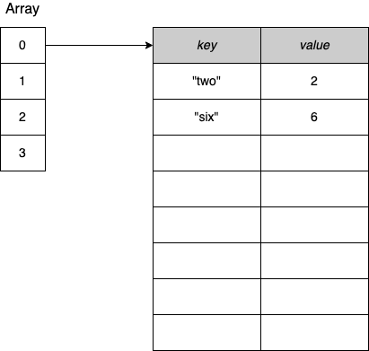
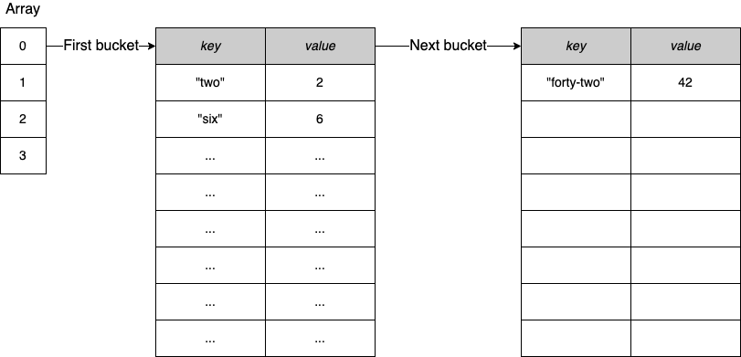

# Maps и утечки памяти в GO.

## Введение:

Map в go исключительно растут и никогда не высвобождаются память(правильный термин shrink). О подобном поведении мало кто знает, но оно ведет к утечкам памяти о которых важно помнить.

При работе с map важно понимать то как они растут и освобождают память. Давайте попробуем понять это детальнее.

## Наглядный пример:

Что бы понять лучше как работают maps в go, давайте приведем наглядный пример.

Создадим специальную функцию, которая будет печать количество используемой (аллоцированой) памяти.

```go
func printAlloc() {
	var m runtime.MemStats
	runtime.ReadMemStats(&m)
	fmt.Printf("%d mb\n", m.Alloc/(1024*1024))
}
```

После этого напишем небольшой кусок кода, по работе с maps.

```go
func main() {
	n := 20_000_000
	m := make(map[int][128]byte)
	printAlloc()

	for i := 0; i < n; i++ {
		m[i] = [128]byte{}
	}
	printAlloc()

	for i := 0; i < n; i++ { 
		delete(m, i)
	}

	runtime.GC() 
	printAlloc()
	runtime.KeepAlive(m) // это нужно что бы GC не собрал нашу map
}
```

Алгоритм действий следующий:

1. Создаем пустую map
2. Заполним ее 20_000_000 объектов
3. Выведем количество памяти
4. Удалим все элементы
5. Превентивно вызовем garbage collector
6. Выведем количество памяти

Выведем результат этой программы:

```bash
0 mb <-- После создания пустой map
7389 mb <-- После добавления 20 миллионов элементов
4694 mb <-- После удаления элементов и GC
```


### Почему же так происходит?

Все дело в том, как устроена map в go. Map в go это неупорядоченная структура данных(не хочу называть это коллекцией), содержащая пары ключей и значений, где все ключи различны. Map реализует hash table, с помощью  массива, где каждый элемент это ссылка(pointer) на bucket(фактически ключ и значение).



Bucket фиксированного размера, в 8 элементов. В случаи вставки в заполненный bucket, go создает новый bucket и соединяет их с предыдущим.



Реализовано это в пакете runtime. Наша map это структура hmap. Структура эта содержит несколько полей, но причиной данной утечки памяти является поле B.

```go
// A header for a Go map.
type hmap struct {
	// Note: the format of the hmap is also encoded in cmd/compile/internal/reflectdata/reflect.go.
	// Make sure this stays in sync with the compiler's definition.
	count     int // # live cells == size of map.  Must be first (used by len() builtin)
	flags     uint8
	B         uint8  // log_2 of # of buckets (can hold up to loadFactor * 2^B items)
	noverflow uint16 // approximate number of overflow buckets; see incrnoverflow for details
	hash0     uint32 // hash seed

	buckets    unsafe.Pointer // array of 2^B Buckets. may be nil if count==0.
	oldbuckets unsafe.Pointer // previous bucket array of half the size, non-nil only when growing
	nevacuate  uintptr        // progress counter for evacuation (buckets less than this have been evacuated)

	extra *mapextra // optional fields
}
```

> Внимательный читатель уже скорее всего догадался в чем причина, и объяснять это не требуется. Но важно сказать, что map это ссылочный тип, и лучше не использовать map как глобальную переменную.
>

Поле B это количество buckets. После добавления элементов оно равно логорифму от количества buckets. После удаления элементов, это поле остается прежним. Мы удалили данные, но память осталась зарезервированной под нужное количество элементов. Поэтому map может расти и не освобождать память до конца.

Вызов сборщика мусора не повлияет на данную ситуацию, при такой конфигурации map. Это может стать проблемой если вы решили сделать кэш в своем приложении для большого количества элементов.

## Как избежать проблем?

Всего может быть два сценария, не считая перезапуска приложения.

1. После удаления не нужных элементов создать новую map и скопировать в нее данные
2. Изменить тип данных map. Например так: **m := make(map[int]*[128]byte)**

В первом случаи, это сработает потому что мы просто не создадим не нужное количество buckets. Во втором, нам поможет GC, так как теперь наши данные находятся на\в куче, и GC сможет подчистить за нами мусор.

---

<aside>
Так же вы можете подписаться на мой youtube канал.


[Gleb Nazemnov](https://www.youtube.com/channel/UC0y2imcpHCM97-MV1lUQvKg/featured)